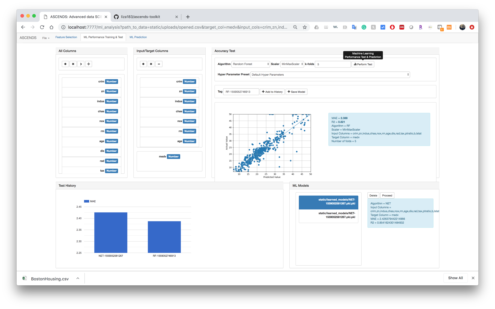
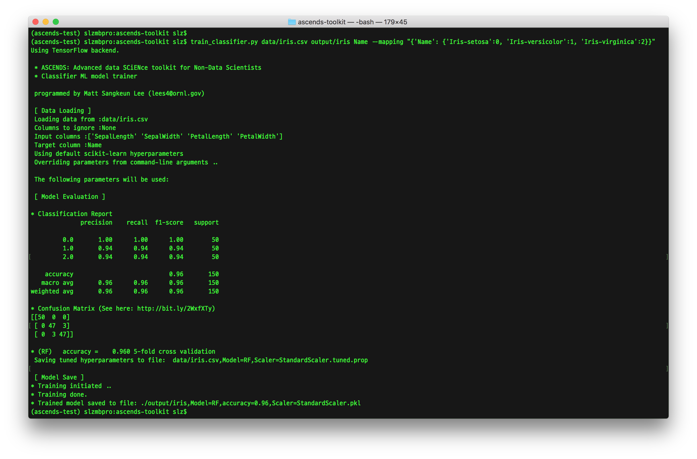

# Summary

Advances in big data technology, artificial intelligence, and machine learning have created so many success stories in a wide range of areas, especially in industry. These success stories have been motivating scientists, who study physics, chemistry, materials, medicine and many more, to explore a new pathway of utilizing big data tools for their scientific activities. However, there are barriers to overcome. Most existing big data tools, systems, and methodologies have been developed for scientists (or any users) who have no or little knowledge of programming. 

Ascends is a toolkit that is developed to assist scientists (or any persons) who want to use their data for machine learning tasks. Users still need to understand what they want to do but not necessarily how it works. Ascends provides a set of simple but powerful tools for non-data scientists to be able to intuitively perform various advanced data analysis and machine learning techniques with simple interfaces (a command-line interface and a web-based GUI). Ascends has been implemented by wrapping around open-source software including Keras [@gulli2017deep], tensorflow [@abadi2016tensorflow], scikit-learn [@pedregosa2011scikit].

-

-

Ascends provides three capabilities as follows.
- Correlation analysis [@ezekiel1930methods]: Users can measure the correlation between input variables (X) and an output variable (Y) using various correlation coefficients including Pearson's correlation coefficient [@sedgwick2012pearson] and maximal information coefficient [@kinney2014equitability]. 
- Training, testing, saving and using classification models [@ren2003learning]: Users can train a predictive model (mapping function) that predicts a category (Y) from input variables (X) using Ascends. For instance, Ascends can train a model for predicting whether an email is a spam or not-spam.
- Training, testing, saving and using regression models [@darlington1990regression]: Users can train a predictive model (mapping function) that approximates a continuous output variable (y) from input variables (X) using Ascends. For instance, Ascends can train a model for predicting the value of a house based on square footage, number of bedrooms, number of cars that can be parked in its garages, number of storages.

Earlier versions of Ascends have been used for scientific researches such as [@shin2019modern] [@shin2017petascale] [@wang2019machine]. 

# References
